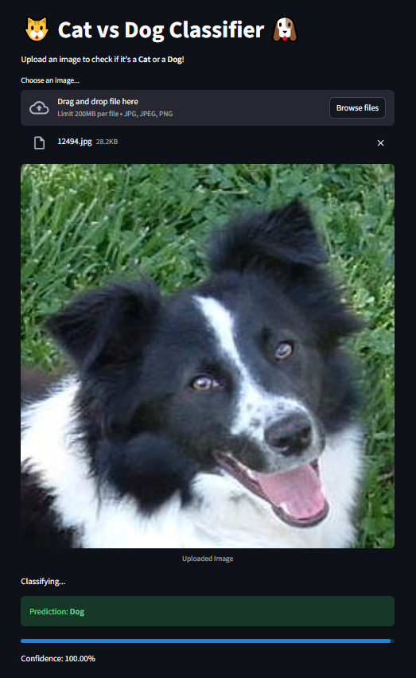
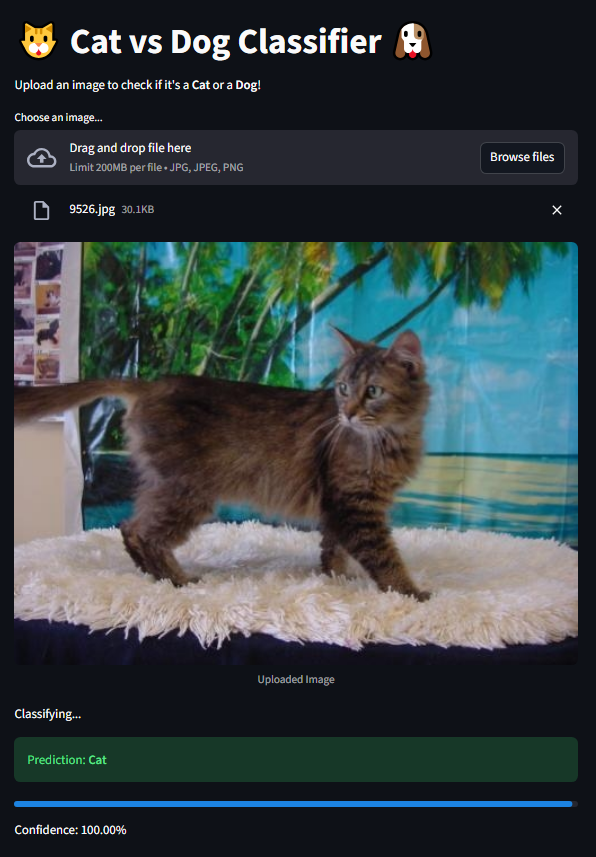

# Cats vs Dogs Transfer Learning

Este projeto adapta um script de Transfer Learning (usando VGG16) para classificar imagens de cães e gatos.

## Funcionalidades

- **Transfer Learning**: Utiliza a rede VGG16 pré-treinada no ImageNet como extrator de características.
- **Seleção Aleatória**: Permite definir um número `n` de imagens (`NUM_IMAGES_PER_CLASS`) para carregar aleatoriamente do dataset, facilitando testes rápidos.
- **Suporte a GPU**: Verifica e configura automaticamente o uso de GPU (compatível com NVIDIA MX150), ativando o "memory growth" para evitar erros de alocação.
- **Visualização**: Salva gráficos de perda e acurácia em `training_history.png`.

## Requisitos

- Python 3.x
- TensorFlow / Keras
- NumPy
- Matplotlib
- Pillow (PIL)

Instalação das dependências:
```bash
pip install tensorflow numpy matplotlib pillow
```

## Estrutura de Pastas Esperada

O script espera que as imagens estejam na pasta `PetImages` no mesmo diretório:

```
/
├── transfer_learning.py
├── PetImages/
│   ├── Cat/
│   │   ├── 0.jpg
│   │   └── ...
│   └── Dog/
│       ├── 0.jpg
│       └── ...
```

## Configuração

No início do arquivo `transfer_learning.py`, você pode ajustar as seguintes constantes:

- `NUM_IMAGES_PER_CLASS`: Número de imagens a serem usadas por classe (ex: 1000).
- `BATCH_SIZE`: Tamanho do batch de treinamento (ex: 32).
- `EPOCHS`: Número de épocas de treinamento (ex: 10).

## Execução

Para rodar o treinamento:

```bash
python transfer_learning.py
```

Ao final, o modelo será salvo como `cats_dogs_transfer_model.h5` e o gráfico de desempenho como `training_history.png`.

## Aplicação Web (Streamlit)

Para usar a interface gráfica e fazer previsões em novas imagens:

1. Instale o Streamlit:
   ```bash
   pip install streamlit
   ```

2. Execute o app:
   ```bash
   streamlit run app.py
   ```

## Print do Teste
- Cachorro



- Gato


